# Plano de Ação — Expansão do Dashboard Eletrofrio

a paleta de cores desse sistema deve ser branco e #00AFC9 alem disso retorne o design original da navbar e troque a cor da sidebar para branco com detalhes em #00AFC9

## Visão Geral

Transformar o dashboard atual (2 abas) em uma plataforma de monitoramento completa (8 seções) em **5 fases incrementais**. Cada fase entrega valor funcional independente.

```mermaid
gantt
    title Fases de Implementação
    dateFormat X
    axisFormat %s
    section Fase 0
    Infraestrutura (Sidebar + Design System)  :f0, 0, 2
    section Fase 1
    Mapa de Unidades                          :f1, 2, 3
    section Fase 2
    Central de Alarmes                        :f2, 3, 5
    section Fase 3
    Analytics & Relatórios                    :f3, 5, 7
    section Fase 4
    Monitor do Bot + Status do Sistema        :f4, 7, 9
```



---

## Arquitetura Atual (Referência)

| Camada | Arquivo | Função |
|--------|---------|--------|
| Backend | [app.py](file:///c:/Users/macha/Downloads/projeto-Eletrofrio-ScriptBoys-main%20(1)/projeto-Eletrofrio-ScriptBoys-main/src/dashboard/app.py) | Flask routes + API endpoints |
| Template | [index.html](file:///c:/Users/macha/Downloads/projeto-Eletrofrio-ScriptBoys-main%20(1)/projeto-Eletrofrio-ScriptBoys-main/src/dashboard/templates/index.html) | Single-page com views por aba |
| Estilos | [style.css](file:///c:/Users/macha/Downloads/projeto-Eletrofrio-ScriptBoys-main%20(1)/projeto-Eletrofrio-ScriptBoys-main/src/dashboard/static/css/style.css) | CSS único (~1650 linhas) |
| Scripts | [dashboard.js](file:///c:/Users/macha/Downloads/projeto-Eletrofrio-ScriptBoys-main%20(1)/projeto-Eletrofrio-ScriptBoys-main/src/dashboard/static/js/dashboard.js) + [automation.js](file:///c:/Users/macha/Downloads/projeto-Eletrofrio-ScriptBoys-main%20(1)/projeto-Eletrofrio-ScriptBoys-main/src/dashboard/static/js/automation.js) | Lógica das 2 abas atuais |
| Dados | [telemetry_service.py](file:///c:/Users/macha/Downloads/projeto-Eletrofrio-ScriptBoys-main%20(1)/projeto-Eletrofrio-ScriptBoys-main/src/services/telemetry_service.py) | Já tem fetch + normalização de telemetria |
| Dados | [main.py](file:///c:/Users/macha/Downloads/projeto-Eletrofrio-ScriptBoys-main%20(1)/projeto-Eletrofrio-ScriptBoys-main/src/main.py) | Polling de alarmes + upsert no Supabase (tabela `alarmes`) |

**APIs existentes**: `/api/notificacoes`, `/api/stats`, `/api/unidades`, `/api/automation/flags`
**Tabelas Supabase existentes**: `notificacoes_enviadas`, `unidades`, `alarmes`
**API externa Eletrofrio**: alarmes + telemetria por `dispositivoId`

---

## FASE 0 — Infraestrutura & Design System
> **Objetivo**: Migrar de tabbar horizontal para sidebar vertical e unificar tipografia/design tokens.
> **Pré-requisito para**: todas as fases seguintes.

### Tarefas

#### 0.1 Sidebar Navigation

##### [MODIFY] index.html
- Substituir `<nav class="tabbar">` por uma `<aside class="sidebar">` com:
  - Logo Eletrofrio no topo (compacto)
  - Links de navegação com ícones Font Awesome:
    - 📋 Notificações (existente)
    - ⚙️ Automatização (existente)
    - 🏪 Unidades (Fase 1)
    - 🚨 Alarmes (Fase 2)
    - 📊 Analytics (Fase 3)
    - 🤖 Bot (Fase 4)
    - 🔧 Sistema (Fase 4)
  - Indicador de item ativo
  - Botão de colapsar/expandir
- Envolver o conteúdo principal em `<div class="main-wrapper">` com layout flex
- Manter o topbar mas simplificá-lo (sem logo duplicado)

##### [MODIFY] style.css
- Adicionar bloco `.sidebar` com:
  - `position: fixed; left: 0; top: 0; height: 100vh;`
  - Largura: `240px` expandido, `64px` colapsado
  - Background: `var(--ef-navy)` (fundo escuro da marca)
  - Itens: texto branco, hover com cyan accent
  - Transição suave de largura ao colapsar
- Ajustar `.main-wrapper` com `margin-left: 240px` (responsivo)
- Media query `<768px`: sidebar vira overlay com hamburger menu

##### [MODIFY] dashboard.js
- Adaptar `switchTab()` para funcionar com sidebar links
- Adicionar toggle de colapso da sidebar
- Persistir estado (colapsado/expandido) no `localStorage`

---

#### 0.2 Design System Unificado

##### [MODIFY] style.css (topo do arquivo)
- Aplicar Inter como `font-family` global (já está carregada no `<head>`)
- Adicionar tokens para as novas páginas:
  ```css
  --ef-page-bg: #F4F6FB;
  --ef-card-radius: 12px;
  --ef-transition: 0.2s cubic-bezier(0.4, 0, 0.2, 1);
  ```
- Criar classes reutilizáveis:
  - `.page-header` — título + subtítulo da página
  - `.card` — card padrão com shadow e border
  - `.stat-card` — mini card de KPI
  - `.empty-state` — ilustração quando não há dados
  - `.skeleton` — loader tipo skeleton para cards/tabelas

---

## FASE 1 — Mapa de Unidades
> **Objetivo**: Visão geral de todas as lojas com status em tempo real.
> **Dependência**: Fase 0 (sidebar)

### Tarefas

#### 1.1 Backend — Novo endpoint

##### [MODIFY] app.py
- Criar `GET /api/unidades/resumo`:
  - Para cada unidade, agregar:
    - Contagem de alarmes ativos (tabela `alarmes`)
    - Contagem de notificações recentes (tabela `notificacoes_enviadas`, últimas 24h)
    - Criticidade máxima ativa
    - Último alarme (timestamp)
  - Retorno: lista de unidades enriquecidas com `alarmes_ativos`, `criticidade_max`, `ultimo_alarme`

#### 1.2 Frontend — View de Unidades

##### [MODIFY] index.html
- Adicionar `<section id="view-unidades" class="view" hidden>` contendo:
  - Barra de busca/filtro (por nome da loja, status)
  - Grid de cards (`.unidade-card`) com:
    - Nome da loja, ID
    - Badge: alarmes ativos (colorido por criticidade)
    - Status dot (🟢 Normal / 🟡 Atenção / 🔴 Crítico)
    - Endereço
  - KPIs no topo: Total de unidades, Unidades OK, Unidades em alerta

##### [NEW] static/js/unidades.js
- `fetchUnidadesResumo()` → consulta `/api/unidades/resumo`
- `renderUnidadeCards(data)` → gera grid de cards
- Filtro client-side por nome/status
- Auto-refresh a cada 30s

##### [MODIFY] style.css
- Adicionar estilos para:
  - `.unidade-card` — card com borda esquerda colorida por status
  - `.unidade-grid` — grid responsivo `repeat(auto-fill, minmax(280px, 1fr))`
  - `.status-dot` — dot pulsante (verde/amarelo/vermelho)
  - `.unidade-search` — barra de busca estilizada

---

## FASE 2 — Central de Alarmes
> **Objetivo**: Visão consolidada e detalhada de alarmes ativos e históricos.
> **Dependência**: Fase 0

### Tarefas

#### 2.1 Backend — Endpoints de alarmes

##### [MODIFY] app.py
- Criar `GET /api/alarmes`:
  - Parâmetros: `status`, `criticidade`, `loja_id`, `limit`, `desde` (data ISO)
  - Consulta tabela `alarmes` do Supabase
  - Ordena por `alarmeDhCad` desc
  - Retorno: lista de alarmes + contagens

- Criar `GET /api/alarmes/stats`:
  - Alarmes ativos agora (total)
  - Distribuição por criticidade
  - Top 5 lojas com mais alarmes
  - Alarmes nas últimas 24h vs. 7 dias

#### 2.2 Frontend — View de Alarmes

##### [MODIFY] index.html
- Adicionar `<section id="view-alarmes" class="view" hidden>` com:
  - KPIs: Alarmes ativos, Críticos, Altos, Médios, Baixos
  - Filtros: criticidade, loja, período
  - Tabela de alarmes com colunas:
    - ID, Data/Hora, Loja, Dispositivo, Descrição, Criticidade, Evento, Status
  - Badge de contagem de resultados

##### [NEW] static/js/alarmes.js
- `fetchAlarmes()` → consulta `/api/alarmes` com filtros
- `fetchAlarmesStats()` → consulta `/api/alarmes/stats` para KPIs
- `renderAlarmeRows(data)` → renderiza tabela
- Auto-refresh

##### [MODIFY] style.css
- Reutilizar patterns da tabela de notificações
- Adicionar indicadores visuais por criticidade (borda lateral colorida nas linhas)

---

## FASE 3 — Analytics & Relatórios
> **Objetivo**: Análise histórica, tendências e gráficos para tomada de decisão.
> **Dependência**: Fase 0 + Fase 2 (reutiliza endpoints de stats)

### Tarefas

#### 3.1 Dependência externa — Biblioteca de gráficos

##### [MODIFY] index.html
- Adicionar CDN do Chart.js no `<head>`:
  ```html
  <script src="https://cdn.jsdelivr.net/npm/chart.js@4"></script>
  ```

#### 3.2 Backend — Endpoints de analytics

##### [MODIFY] app.py
- Criar `GET /api/analytics/timeline`:
  - Parâmetro: `dias` (default 30)
  - Agrupa notificações por dia
  - Retorno: `[{data: "2026-06-01", total: 15, enviado: 12, falha: 3}, ...]`

- Criar `GET /api/analytics/top-lojas`:
  - Top 10 lojas com mais alarmes/notificações no período
  - Retorno: `[{lojaId, lojaNm, total_alarmes, total_notificacoes}, ...]`

- Criar `GET /api/analytics/criticidade`:
  - Distribuição de alarmes por criticidade no período
  - Retorno: `{CRITICO: 5, ALTO: 23, MEDIO: 45, BAIXO: 120}`

#### 3.3 Frontend — View de Analytics

##### [MODIFY] index.html
- Adicionar `<section id="view-analytics" class="view" hidden>` com:
  - Seletor de período: Hoje | 7d | 30d | 90d | Customizado
  - Grid 2x2 de gráficos:
    - **Line chart**: Notificações por dia (tendência)
    - **Donut chart**: Distribuição por criticidade
    - **Horizontal bar**: Top 10 lojas com mais alarmes
    - **Bar chart**: Enviados vs Falhas por dia
  - KPIs resumidos no topo

##### [NEW] static/js/analytics.js
- Instanciação e configuração dos 4 gráficos Chart.js
- `fetchTimeline(dias)`, `fetchTopLojas()`, `fetchCriticidade()`
- Função de atualização ao mudar período
- Responsividade dos gráficos

##### [MODIFY] style.css
- `.charts-grid` — grid `2x2` com cards contendo `<canvas>`
- `.period-selector` — botões de período com estilo pill
- Responsivo: 1 coluna em mobile

---

## FASE 4 — Monitor do Bot + Status do Sistema
> **Objetivo**: Auditoria do assistente conversacional e health check dos serviços.
> **Dependência**: Fase 0

### Tarefas

#### 4.1 Backend — Bot Monitor

##### [MODIFY] app.py
- Criar `GET /api/bot/stats`:
  - Total de conversas (tabela de logs do bot, se existir no Supabase)
  - Fallback: contar interações recentes
  - Retorno: `{total_conversas, conversas_hoje, tempo_medio_resposta}`

- Criar `GET /api/bot/logs`:
  - Parâmetros: `limit`, `desde`
  - Lista das últimas interações do bot (pergunta + resposta)
  - Retorno: lista de logs do bot

#### 4.2 Frontend — View do Bot

##### [MODIFY] index.html
- Adicionar `<section id="view-bot" class="view" hidden>` com:
  - KPIs: Conversas hoje, Tempo médio de resposta, Taxa de resolução
  - Tabela de logs do bot:
    - Timestamp, Telefone (mascarado), Pergunta, Resposta, Tokens

##### [NEW] static/js/bot-monitor.js
- `fetchBotStats()`, `fetchBotLogs()`
- Renderização de KPIs e tabela

#### 4.3 Backend — System Status

##### [MODIFY] app.py
- Criar `GET /api/system/health`:
  - Verificar conectividade:
    - Supabase: tenta `SELECT 1` → online/offline
    - API Eletrofrio (alarmes): tenta GET com timeout curto → online/offline/lento
    - Evolution API: verifica status da sessão WhatsApp
  - Retorno: `{supabase: "online", eletrofrio_api: "online", whatsapp: "offline", uptime: "3d 12h"}`

#### 4.4 Frontend — View de Status

##### [MODIFY] index.html
- Adicionar `<section id="view-sistema" class="view" hidden>` com:
  - Cards de status por serviço (dot pulsante verde/vermelho + latência)
  - Informações do sistema: versão, uptime, última sincronização
  - Log de erros recentes (últimas 20 linhas do log)

##### [NEW] static/js/system-status.js
- `fetchSystemHealth()` → consulta `/api/system/health`
- Auto-refresh a cada 15s
- Renderização dos cards de serviço

##### [MODIFY] style.css
- `.service-card` — card com status dot, nome do serviço, latência
- `.service-grid` — grid responsivo
- Estados: `.service-online`, `.service-offline`, `.service-degraded`

---

## Resumo de Arquivos

### Arquivos Existentes Modificados
| Arquivo | Fases |
|---------|-------|
| `app.py` | 1, 2, 3, 4 (novos endpoints) |
| `index.html` | 0, 1, 2, 3, 4 (sidebar + novas views) |
| `style.css` | 0, 1, 2, 3, 4 (sidebar + design system + estilos de cada view) |
| `dashboard.js` | 0 (adaptar switchTab para sidebar) |

### Arquivos Novos
| Arquivo | Fase |
|---------|------|
| `static/js/unidades.js` | 1 |
| `static/js/alarmes.js` | 2 |
| `static/js/analytics.js` | 3 |
| `static/js/bot-monitor.js` | 4 |
| `static/js/system-status.js` | 4 |

### Dependências Externas (CDN)
| Biblioteca | Fase | Uso |
|------------|------|-----|
| Chart.js 4.x | 3 | Gráficos de analytics |

---

## Open Questions

> [!IMPORTANT]
> **Dados do bot**: O bot (`bot_polling.py`) loga as conversas no Supabase? Se sim, qual é o nome da tabela? Isso impacta a Fase 4.1.

> [!IMPORTANT]
> **Telemetria no dashboard**: A Fase de Telemetria em Tempo Real foi excluída deste plano porque depende de consultas diretas à API da Eletrofrio (que tem instabilidades documentadas no artigo). Deseja incluí-la como Fase 5 opcional?

> [!WARNING]
> **Tamanho do `style.css`**: O arquivo já tem ~1650 linhas. A partir da Fase 1, considerar dividir em módulos (`sidebar.css`, `unidades.css`, etc.) e importar via `@import` ou `<link>` separados.

> [!NOTE]
> **Ordem de execução**: Cada fase é independente após a Fase 0. Se preferir, podemos reordenar (ex: começar pela Fase 2 se alarmes são mais urgentes que o mapa de unidades).